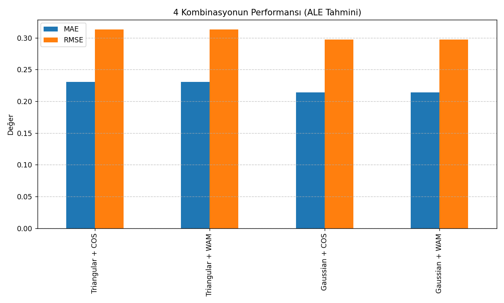

# ALE Prediction using Fuzzy Logic in WSN

Bu proje, Kablosuz Sensör Ağlarındaki düğüm lokalizasyon problemini çözmek için Mamdani Bulanık Çıkarım Sistemi (FIS) geliştirilmiştir. Projede 4 farklı kombinasyon test edilerek ortalama lokalizasyon hatası (ALE) tahmin edilmiştir.

## Proje Özeti

- Amaç:

  - 4 giriş parametresi (anchor ratio, transmission range, node density, iteration count) kullanılarak ALE’yi tahmin etmek
  
  - 2 farklı üyelik fonksiyonu (Triangular & Gaussian) ve 2 defuzzification yöntemi (COS & WAM) kombinasyonlarını karşılaştırmak
  
  - 25 adet mantıksal kural üzerinden bulanık çıkarım sistemi kurmak

- Veri Seti:

  - Toplam 107 gözlem
  - mcs_ds_edited_iter_shuffled.csv dosyası
 
## 📊 Kullanılan Araçlar & Kütüphaneler

- Python 3
- `numpy`, `pandas` – Veri işleme
- `matplotlib` – Grafik çizimi
- `skfuzzy` – Bulanık mantık işlemleri
- `scikit-learn` – MAE, RMSE hesaplamaları

## Temel Özellikler

**Üyelik Fonksiyonları:**

- Tüm girişler ve çıkış için Triangular ve Gaussian MF’ler

**Kurallar:**

- Veriye göre oluşturulmuş 25 mantıksal kural

**Çıkarım & Defuzzification:**

- Mamdani sistem

- 2 farklı berraklaştırma (COS & WAM)

- Her kombinasyon için tahmin ve hata ölçümleri

**Sonuçlar:**

- MAE (Mean Absolute Error) ve RMSE (Root Mean Squared Error)
   

## 📈 Sonuçlar Örneği

| Kombinasyon          | MAE     | RMSE    |
|-----------------------|---------|---------|
| Triangular + COS      | 0.23    | 0.31    |
| Triangular + WAM      | 0.23    | 0.31    |
| Gaussian + COS        | 0.21    | 0.29    |
| Gaussian + WAM        | 0.21    | 0.29    |

## 🖼️ Grafikler

Girdi değişkenleri için **üçgensel ve gauss MF grafik** çizimi 


## 🛠️ Çalıştırma Adımları

1️⃣ Gerekli kütüphaneleri yükle:
```bash
pip install numpy pandas matplotlib scikit-fuzzy scikit-learn
```
2️⃣ Python betiğini çalıştır:
```
python main.py
```
3️⃣ Sonuçlar terminalde ve grafiklerde görüntülenir.

## Veri kümesi:

[UCI WSN Localization Dataset](https://archive.ics.uci.edu/dataset/844/average+localization+error+(ale)+in+sensor+node+localization+process+in+wsns)

