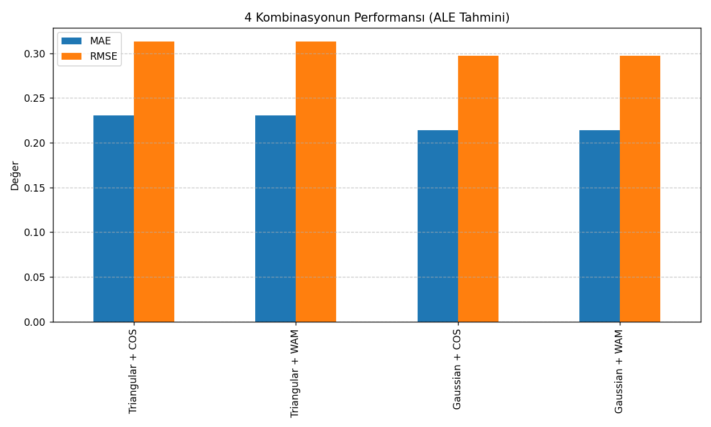

# ALE Prediction using Fuzzy Logic in WSN

This project develops a Mamdani Fuzzy Inference System (FIS) to solve the node localization problem in Wireless Sensor Networks (WSNs). Four different combinations were tested to predict the Average Localization Error (ALE).

## Project Overview

- Objectives:

  - Predict ALE using 4 input parameters: anchor ratio, transmission range, node density, and iteration count.
  
  - Compare combinations of 2 different membership functions (Triangular & Gaussian) and 2 defuzzification methods (Centroid/COS & Weighted Average/WAM).
  
  - Establish a fuzzy inference system based on 25 logical rules.

- Dataset:

  - Total Observations: 107
  - File: mcs_ds_edited_iter_shuffled.csv 
 
##  Tools & Libraries

- Python 3
- `numpy`, `pandas` : Data processing
- `matplotlib` : Data visualization
- `skfuzzy` : Fuzzy logic operations
- `scikit-learn` : Error metrics (MAE, RMSE) calculation

## Key Features

**Membership Functions (MF):**

- Triangular and Gaussian MFs applied to all inputs and the output.

**Rule Base:**

- 25 logical rules derived from the dataset.

**Inference & Defuzzification:**

- Mamdani-style inference

- Two distinct defuzzification methods: Centroid (COS) and Weighted Average (WAM).

- Prediction and error measurements for every combination.

**Performance Metrics:**

- MAE (Mean Absolute Error) and RMSE (Root Mean Squared Error)

 

## Example Resuslts

| Kombinasyon          | MAE     | RMSE    |
|-----------------------|---------|---------|
| Triangular + COS      | 0.23    | 0.31    |
| Triangular + WAM      | 0.23    | 0.31    |
| Gaussian + COS        | 0.21    | 0.29    |
| Gaussian + WAM        | 0.21    | 0.29    |

## Visualizations

The project generates Triangular and Gaussian MF plots for all input variables to visualize the degree of membership for each linguistic variable.

## Execution Steps

1️⃣ Install the required libraries:
```bash
pip install numpy pandas matplotlib scikit-fuzzy scikit-learn
```
2️⃣ Run the Python script:
```
python main.py
```
3️⃣ Outputs will be displayed in the terminal and via generated plots.

## Dataset:

[UCI WSN Localization Dataset](https://archive.ics.uci.edu/dataset/844/average+localization+error+(ale)+in+sensor+node+localization+process+in+wsns)

